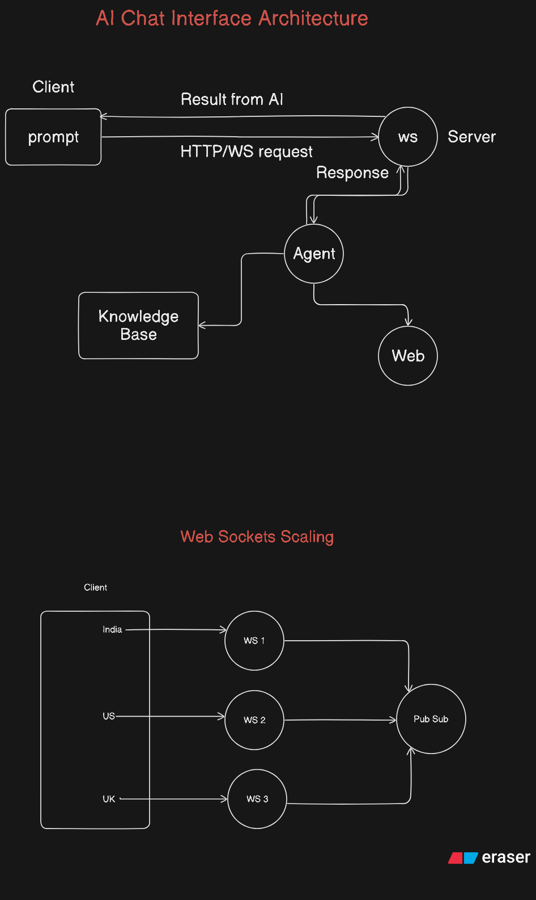

# 🎓 Study Buddy: Tutor ReAct Agent

   

> **Learn faster. Revise smarter. Remember longer.**
> An AI-powered tutor that teaches, revises, and refreshes concepts in the simplest way possible — using its own knowledge base **plus** live web searches for the most up-to-date, accurate answers.

---

## ✨ Overview

Deep diving into the world of **AI Agents**, our goal is to build a **simple yet powerful AI tutor** for students across various subjects.

- 📚 **Understands concepts** from its own maintained knowledge base.
- 🌐 **Searches the web** (Wikipedia & more) to stay current.
- 🧠 **Explains in plain language** for efficient learning.
- ⚡ **Quick recall & revision** for exams and practice.

Maintains its own knowledge base while tapping into the web for real-time information, delivering **concise, accurate, and easy-to-digest** answers for students on the go.

---

## 🚀 Features

- 🔍 **Search Wikipedia & other websites** for relevant info.
- 🗄 **Self-maintained knowledge base** for offline references.
- 🖼 **Multiple text & image generation models** to produce rich learning material.

---

## 🛠 Technologies Used

- ⚙ **LangChain** + **Ollama + Fast API + WebSockets**
- 🎨 **React + Apollo Client**

---

## 📌 System Diagram

---
